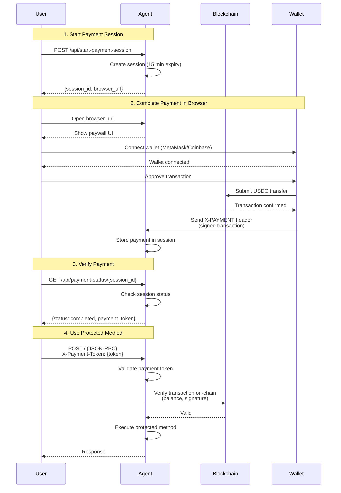

# Payment Integration (X402)

Bindu supports the **X402 payment protocol**, enabling you to monetize your AI agents by requiring cryptocurrency payments before executing specific methods. This allows you to build paid AI services with native blockchain payment integration.

## How It Works



## Configuration

Add the `execution_cost` configuration to your agent config to enable payment gating.

### Single payment option (existing behavior)

```python
config = {
    "author": "your.email@example.com",
    "name": "paid_agent",
    "description": "An agent that requires payment",
    "deployment": {"url": "http://localhost:3773", "expose": True},
    "execution_cost": {
        "amount": "$0.0001",           # Amount in USD (will be converted to USDC)
        "token": "USDC",                # Token type (USDC supported)
        "network": "base-sepolia",      # Network (base-sepolia for testing, base for production)
        "pay_to_address": "0x265<your-wallet-address>",  # Your wallet address
        "protected_methods": [
            "message/send"              # Methods that require payment
        ]
    }
}
```

### Multiple payment options (new behavior)

You can now provide **multiple** payment options. The agent will advertise all options
to the client, and any one of them can satisfy the requirement. For example:

```python
config = {
    "author": "your.email@example.com",
    "name": "paid_agent",
    "description": "An agent that requires payment",
    "deployment": {"url": "http://localhost:3773", "expose": True},
    "execution_cost": [
        {
            "amount": "0.1",              # 0.1 USDC on Base
            "token": "USDC",
            "network": "base",
            "pay_to_address": "0xYourWalletAddressHere",
        },
        {
            "amount": "0.0001",           # 0.0001 ETH on Ethereum mainnet
            "token": "ETH",
            "network": "ethereum",
            "pay_to_address": "0xYourWalletAddressHere",
        },
    ],
}
```

In this configuration, callers can pay **either** 0.1 USDC on Base **or** 0.0001 ETH
on Ethereum to access the protected methods.

### Reaching networks beyond Base — SKALE as the worked example

The x402 v2 SDK ships built-in pricing for Base mainnet and Base Sepolia only.
For any other EVM chain — SKALE, Polygon, Avalanche, Ethereum mainnet, etc. —
two pieces have to line up:

1. **A facilitator that supports the chain.** The facilitator runs the
   on-chain verification and settlement step. Coinbase's default
   facilitator (`https://x402.org/facilitator`) supports Base and a handful
   of non-EVM chains only — it does **not** know SKALE today. To reach
   SKALE you must point Bindu at a facilitator that does (see [Live
   facilitator support](#live-facilitator-support) below).

2. **An entry in `extra_networks`.** Bindu's `X402Settings.extra_networks`
   lets you register the asset metadata for any EVM chain the facilitator
   you chose advertises. Each entry teaches Bindu how to convert a price
   like `"0.01"` into atomic units of the right ERC-20 contract on that
   chain.

The default config already ships one example so the shape is visible:

```python
# bindu/settings.py
extra_networks = {
    "skale-europa": ExtraNetwork(
        caip2="eip155:1187947933",
        asset="0x85889c8c714505E0c94b30fcfcF64fE3Ac8FCb20",
        asset_name="Bridged USDC (SKALE Bridge)",
        asset_decimals=6,
        asset_eip712_version="2",
    ),
}
```

With that registered, your agent can use the friendly slug in
`execution_cost`:

```python
config = {
    "execution_cost": [
        {
            "amount": "0.01",
            "token": "USDC",
            "network": "skale-europa",   # → eip155:1187947933 downstream
            "pay_to_address": "0xYourSKALEAddress",
        }
    ],
    ...
}
```

The same pattern adds Polygon, Avalanche, Ethereum mainnet, or any other
EVM chain — copy the `ExtraNetwork` block and fill in the chain's CAIP-2
+ USDC contract.

#### Live facilitator support

| Facilitator | Networks | Notes |
|---|---|---|
| `https://x402.org/facilitator` (default) | Base, Solana, Algorand, Aptos, Stellar | Coinbase-operated. **No SKALE.** |
| `https://facilitator.x402.fi` | Base, Polygon, Ethereum, Avalanche, **5 SKALE chains** (Europa, Calypso, Nebula variants), Solana | Multi-chain; cert is currently expired (see [`bugs/known-issues.md`](../bugs/known-issues.md)). |

To switch your agent to a SKALE-aware facilitator, set
`X402__FACILITATOR_URL=https://facilitator.x402.fi` in your environment
(or override `app_settings.x402.facilitator_url` in code).

> **Production caveat.** The only SKALE-aware facilitator we've verified
> at the time of writing has an expired TLS certificate. Production
> deployments should not silently accept that — either wait for the
> operator to rotate the cert, or run your own facilitator instance.
> The shipped configuration assumes Base (the validated default).

## Setup for Testing

### 1. Create a Crypto Wallet

Choose one of these wallet options:

**MetaMask (Recommended):**
1. Install the [MetaMask browser extension](https://metamask.io/)
2. Create a new wallet or import an existing one
3. Copy your wallet address (starts with `0x...`)

**Coinbase Wallet:**
1. Install the [Coinbase Wallet extension](https://www.coinbase.com/wallet)
2. Set up your wallet
3. Copy your wallet address

### 2. Get Test USDC

For testing on Base Sepolia testnet:

1. **Get Base Sepolia ETH** (for gas fees):
   - Visit [Chainlink Faucet](https://faucets.chain.link/base-sepolia)
   - Connect your wallet
   - Request test ETH

2. **Get Base Sepolia USDC**:
   - The payment system will guide you through obtaining test USDC
   - Alternatively, use a Base Sepolia faucet that provides USDC

### 3. Update Agent Configuration

Add your wallet address to the agent config:

```python
"pay_to_address": "0xYourWalletAddressHere"  # Replace with your actual address
```

## Payment Flow

### Step 1: Start a Payment Session

When a user tries to access a protected method, they must first initiate a payment session:

```bash
curl --location --request POST 'http://localhost:3773/api/start-payment-session' \
--header 'Content-Type: application/json' \
--header 'Authorization: Bearer <your-access-token>'
```

**Response:**
```json
{
    "session_id": "<session-id>",
    "browser_url": "http://localhost:3773/payment-capture?session_id=<session-id>",
    "expires_at": "<expires-at>",
    "status": "pending"
}
```

### Step 2: Complete Payment in Browser

1. Open the `browser_url` in your web browser
2. Connect your wallet (MetaMask or Coinbase Wallet)
3. Review the payment details:
   - Amount in USDC
   - Recipient address
   - Network (Base Sepolia)
4. Approve and sign the transaction
5. Wait for blockchain confirmation


### Step 3: Verify Payment Status

After completing the payment, check the session status:

```bash
curl --location 'http://localhost:3773/api/payment-status/<session_id>' \
--header 'Authorization: Bearer <your-access-token>'
```

**Successful Payment Response:**
```json
{
    "session_id": "<session-id>",
    "status": "completed",
    "payment_token": "eyJhbGciOiJIUzI1NiIsInR5cCI6IkpXVCJ9..."
}
```


**Response Fields:**
- `session_id`: The payment session identifier
- `status`: Payment status (`completed` means payment verified)
- `payment_token`: JWT token to include in subsequent API calls

### Step 4: Use the Agent with Payment Token

Include the `payment_token` in your agent requests:

```bash
curl --location 'http://localhost:3773/' \
--header 'Content-Type: application/json' \
--header 'Authorization: Bearer <your-access-token>' \
--header 'X-Payment-Token: <payment-token>' \
--data '{
    "jsonrpc": "2.0",
    "method": "message/send",
    "params": {
        "message": {
            "role": "user",
            "content": "Hello, paid agent!"
        }
    },
    "id": 1
}'
```

## Example Implementation

See the complete example at:
```
examples/beginner/echo_agent_behind_paywall.py
```

## UI Integration

From the UI, you can obtain the access token and use it to initiate payment sessions.

**Important Payment Behavior:**
- Each new task requires payment when the agent is behind a paywall
- If a task returns `input_required` status, no payment is needed for that interaction
- Once a task completes successfully, a new payment is required for the next task, even within the same conversation/context
- Payment tokens are task-specific and cannot be reused across multiple completed tasks

## Security Considerations

- **Wallet Security**: Never share your private keys or seed phrases
- **Test Networks**: Always test on Base Sepolia before deploying to mainnet
- **Payment Verification**: Payments are verified on-chain via blockchain signatures
- **Session Expiration**: Payment sessions expire after 60 seconds by default
- **Token Storage**: Payment tokens are JWTs with expiration times

## Production Deployment

When ready for production:

1. **Switch to Base Mainnet**:
   ```python
   "network": "base"  # Change from "base-sepolia"
   ```

2. **Use Real USDC**: Ensure users have actual USDC on Base mainnet

3. **Update Wallet Address**: Use your production wallet address

4. **Monitor Payments**: Track incoming payments to your wallet address

5. **Set Appropriate Pricing**: Adjust `amount` based on your service value

## Tips

- **Start Small**: Use low amounts for testing (e.g., `$0.0001`)
- **Clear Communication**: Inform users about payment requirements upfront
- **Handle Failures**: Implement proper error handling for failed payments
- **Session Management**: Clean up expired payment sessions regularly
- **User Experience**: Provide clear instructions in your UI for payment flow


## Related Documentation

- [X402 Protocol Specification](https://github.com/coinbase/x402)
- [Base Sepolia Testnet](https://docs.base.org/network-information)
- [Bindu Authentication](./AUTHENTICATION.md) - Required for payment endpoints
