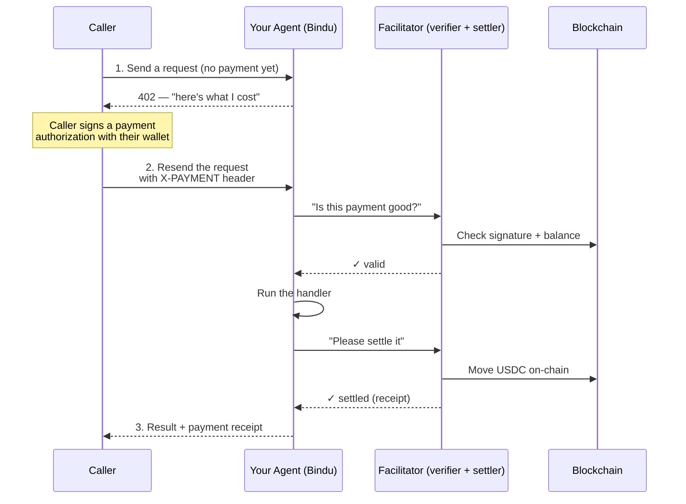

# Charging for your agent

You built something useful. People want to use it. Running it costs you
real money — LLM tokens, compute, maybe a paid API behind the scenes —
and you'd like callers to chip in before the agent does the work.

That's what this page is about. Bindu plugs into a payment protocol
called [x402](https://github.com/coinbase/x402), which lets you say
*"this method costs 0.01 USDC; pay first, then I'll run it"*. Callers
sign a one-shot authorization with their wallet, the payment settles on
a blockchain, and your agent runs only when the money has changed hands.
You don't deal with the chain directly — Bindu and a separate piece
called a *facilitator* handle that — but understanding the shape of
the flow will save you a lot of head-scratching when something doesn't
work, so let's walk through it.

## The five-second picture



Four moving parts, three trips:

1. **Caller** — anything that can speak HTTP. A script, another agent, a browser.
2. **Your agent** — runs on top of Bindu. It's the gatekeeper: it tells callers what it costs, accepts proof of payment, then runs the actual work.
3. **The facilitator** — a separate service Bindu talks to. The facilitator is the one that actually reads the signature, checks the chain, and broadcasts the transfer. Bindu doesn't speak to the blockchain directly; it speaks to the facilitator and trusts its yes/no answer. *We'll talk about which facilitator to use further down.*
4. **The blockchain** — where the USDC actually moves. From Bindu's point of view this is the facilitator's problem; you only care that the receipt comes back.

That's the whole mental model. The rest of this doc is about the dials you turn, the things you'll see on the wire, and how to spot trouble when things misbehave.

## Turning payments on — the smallest possible config

Add one block to your agent config. Pick a network, an amount, and an address you want the money to land in.

```python
config = {
    "author": "you@example.com",
    "name": "paid_agent",
    "description": "An agent that earns its keep.",
    "deployment": {"url": "http://localhost:3773", "expose": True},

    # ← The whole "I cost money" surface lives in this block.
    "execution_cost": {
        "amount": "0.01",                  # 1 cent per call. Use a string, not float.
        "token": "USDC",                   # USDC is what's supported today.
        "network": "base-sepolia",         # Base's testnet — perfect for learning.
        "pay_to_address": "0xYourWallet",  # Where the money lands.
    },
}
```

Once that's in place, any caller hitting your agent without payment gets a 402 response describing exactly what's required: which network, which token, which amount, and where to send it. They sign a one-shot authorization with their wallet, retry with that authorization in the `X-PAYMENT` header, and now the request actually runs.

> **About the network.** `base-sepolia` is Base's testnet — fake money, fake gas, perfect for experimenting. When you're ready for real revenue, change it to `base`. Don't ship to `base` until you're sure you actually want to charge people on the live chain.

## Charging more than one way

Sometimes you want options — maybe you'll take USDC on Base, OR a small amount of ETH on Ethereum mainnet for users who don't want to bridge. Make `execution_cost` a list instead of a single dict:

```python
"execution_cost": [
    {
        "amount": "0.1",
        "token": "USDC",
        "network": "base",
        "pay_to_address": "0xYourWallet",
    },
    {
        "amount": "0.0001",
        "token": "ETH",
        "network": "ethereum",
        "pay_to_address": "0xYourWallet",
    },
],
```

When a caller is unpaid, your agent's 402 response includes both options and they pick one. Same code, just more flexibility for the caller.

## Going beyond Base (SKALE, Polygon, anything else)

Out of the box, Bindu's underlying x402 library only knows about Base mainnet and Base Sepolia. That's because Base is where Coinbase runs the default facilitator, and the SDK ships the asset info for Base USDC baked in.

To accept payment on *any other* EVM chain — SKALE, Polygon, Avalanche, Ethereum mainnet — two things have to be true at the same time:

1. **You point your agent at a facilitator that knows the chain.** Different facilitators support different chains. Coinbase's default (`https://x402.org/facilitator`) does Base and a handful of non-EVM things. If you want SKALE, you need a SKALE-aware facilitator.

2. **Your agent knows what the USDC contract is on that chain.** Each chain has a different address for the bridged USDC token. Bindu has a config slot called `extra_networks` where you (or we, in the defaults) declare it.

Here's what the SKALE Europa Hub entry looks like — and it ships in the defaults, so you can copy it as a template for any other chain:

```python
# bindu/settings.py
extra_networks = {
    "skale-europa": ExtraNetwork(
        caip2="eip155:1187947933",                              # Chain ID, in CAIP-2 form
        asset="0x85889c8c714505E0c94b30fcfcF64fE3Ac8FCb20",     # USDC contract on this chain
        asset_name="Bridged USDC (SKALE Bridge)",               # Required for EIP-712 signing
        asset_decimals=6,                                        # USDC uses 6 decimals
        asset_eip712_version="2",                                # Token contract's domain version
    ),
}
```

With that registered, you can use the friendly slug in your agent config — Bindu translates it to the right chain ID and asset under the hood:

```python
"execution_cost": [
    {
        "amount": "0.01",
        "token": "USDC",
        "network": "skale-europa",   # Bindu knows what this means now
        "pay_to_address": "0xYourSKALEWallet",
    }
],
```

Same shape works for any other EVM chain — just add another entry to `extra_networks` with the chain's CAIP-2 string and its USDC contract address.

### Which facilitator can I use?

| Facilitator | Networks it supports | Notes |
|---|---|---|
| `https://x402.org/facilitator` *(default)* | Base, Solana, Algorand, Aptos, Stellar | Coinbase-operated. Solid. Doesn't know SKALE. |
| `https://facilitator.x402.fi` | Base + Polygon + Ethereum + Avalanche + **5 SKALE chains** + Solana | Run by the x402.fi team. Currently has an expired TLS cert — see [`bugs/known-issues.md`](../bugs/known-issues.md) before using in production. |

To swap, set an environment variable:

```bash
export X402__FACILITATOR_URL=https://facilitator.x402.fi
```

That's it — Bindu picks it up at startup. For production though, please read the next box before you ship.

> **Production caveat.** The only public facilitator that supports SKALE today has an expired TLS certificate. That's not a Bindu problem; it's an operational issue on their end. Until they rotate the cert, "SKALE in production" really means "run your own facilitator". The defaults still point at Coinbase, which is what we recommend until your SKALE story is solid.

## Watching it work — end-to-end, on your laptop, in five minutes

Here's the most useful thing you can do to understand how this whole flow hangs together: run it locally with a fake facilitator that always says yes. No wallet, no real money, no blockchain — just your agent, a stub facilitator, and curl.

> **Already-built version:** [`tests/e2e/x402_scenarios/`](../tests/e2e/x402_scenarios/) has a one-command driver that boots a programmable fake facilitator plus an echo agent and walks through all four failure modes from issue [#562](https://github.com/GetBindu/Bindu/issues/562) (drain attack, settle timeout, parallel-nonce race, replay). Run it with `uv run python tests/e2e/x402_scenarios/run_e2e.py` to see real HTTP responses + task metadata for each scenario. The walkthrough below is the same idea, broken apart so you can follow along by hand.

We'll do it in three small files. Open three terminals.

### Step 1 — a fake facilitator

This is a tiny HTTP server that pretends to be the facilitator. It implements the three endpoints Bindu actually calls — `/supported`, `/verify`, `/settle` — and just returns "yes, that payment is good" for any input. Useful for development; **never use it in production.**

Save as `mock_facilitator.py`:

```python
"""Local mock x402 facilitator. Always says yes."""
import uvicorn
from starlette.applications import Starlette
from starlette.requests import Request
from starlette.responses import JSONResponse
from starlette.routing import Route


async def supported(request: Request) -> JSONResponse:
    # Tell Bindu which chains we 'support'.
    return JSONResponse({
        "kinds": [
            {"x402Version": 2, "scheme": "exact", "network": "eip155:1187947933"},  # SKALE
            {"x402Version": 2, "scheme": "exact", "network": "eip155:84532"},       # Base Sepolia
        ],
        "extensions": [],
        "signers": {"eip155:*": ["0xf00df00df00df00df00df00df00df00df00df00d"]},
    })


async def verify(request: Request) -> JSONResponse:
    # Real facilitators check the signature + balance here. We just say yes.
    body = await request.json()
    payer = body["paymentPayload"]["payload"]["authorization"]["from"]
    return JSONResponse({"isValid": True, "invalidReason": None, "payer": payer})


async def settle(request: Request) -> JSONResponse:
    # Real facilitators broadcast a transfer transaction here.
    # We return a made-up transaction hash.
    body = await request.json()
    payer = body["paymentPayload"]["payload"]["authorization"]["from"]
    return JSONResponse({
        "success": True,
        "errorReason": None,
        "payer": payer,
        "transaction": "0x" + "ab" * 32,
        "network": body["paymentRequirements"]["network"],
    })


app = Starlette(routes=[
    Route("/supported", supported, methods=["GET"]),
    Route("/verify", verify, methods=["POST"]),
    Route("/settle", settle, methods=["POST"]),
])

if __name__ == "__main__":
    uvicorn.run(app, host="127.0.0.1", port=3775, log_level="warning")
```

Run it: `python mock_facilitator.py`. You should see uvicorn listening on port 3775.

### Step 2 — an agent that points at it

Save as `success_agent.py`. The handler just echoes back what the caller sent — the whole point is to see whether payment gating actually works, not to do anything fancy.

```python
import os

# Tell Bindu to use our fake facilitator instead of Coinbase's.
os.environ["X402__FACILITATOR_URL"] = "http://127.0.0.1:3775"

from bindu.penguin.bindufy import bindufy


def handler(messages):
    last = messages[-1].get("content", "") if messages else ""
    return f"PAID JOB DONE — agent received: '{last}'"


bindufy(
    {
        "author": "demo@example.com",
        "name": "success_agent",
        "description": "Demo agent — paid work behind a paywall.",
        "deployment": {"url": "http://localhost:3773", "expose": False},
        "execution_cost": {
            "amount": "0.01",
            "token": "USDC",
            "network": "skale-europa",
            "pay_to_address": "0x742d35Cc6634C0532925a3b844Bc454e4438f44e",
        },
        "skills": [],
        "storage": {"type": "memory"},
        "scheduler": {"type": "memory"},
    },
    handler,
)
```

Run it: `python success_agent.py`. You'll see the agent boot, ask the fake facilitator what it supports, and start listening on port 3773.

### Step 3 — try every path

Now you have a live setup. Let's walk through what each kind of request looks like — both the failures (which are the safety net you actually want) and the success (which is what you're trying to get to).

#### "I forgot to pay"

```bash
curl -s -X POST http://localhost:3773/ -H 'Content-Type: application/json' \
  -d '{"jsonrpc":"2.0","method":"message/send","id":"'"$(uuidgen)"'","params":{
    "configuration":{"accepted_output_modes":["text"]},
    "message":{"role":"user","kind":"message",
      "parts":[{"kind":"text","text":"hi"}],
      "messageId":"'"$(uuidgen)"'",
      "contextId":"'"$(uuidgen)"'",
      "taskId":"'"$(uuidgen)"'"}}}'
```

You get back **HTTP 402** with a body that tells you exactly what to do:

```json
{
  "x402Version": 2,
  "error": "X-PAYMENT header required",
  "accepts": [
    {
      "scheme": "exact",
      "network": "eip155:1187947933",
      "asset": "0x85889c8c714505E0c94b30fcfcF64fE3Ac8FCb20",
      "amount": "10000",
      "payTo": "0x742d35Cc6634C0532925a3b844Bc454e4438f44e",
      "maxTimeoutSeconds": 60,
      "extra": {"name": "Bridged USDC (SKALE Bridge)", "version": "2"}
    }
  ]
}
```

Take a moment to look at what just happened. Your config said `"amount": "0.01"` and `"network": "skale-europa"`. On the wire that became `"amount": "10000"` (atomic units — 0.01 × one million, because USDC has 6 decimals) and `"network": "eip155:1187947933"` (the CAIP-2 chain identifier for SKALE Europa). That translation is the whole point of `extra_networks`.

#### "I sent garbage"

```bash
printf '\xff\xfe garbage' | curl -s -X POST http://localhost:3773/ \
  -H 'Content-Type: application/json' --data-binary @-
```

You get a 402 with `"error": "Malformed JSON-RPC body"`. The agent doesn't even try to run the handler — bad bodies get rejected before they can sneak past the payment check. (This used to be a bug where bad bodies snuck through unpaid; it's fixed now.)

#### "I'm trying to pay with the same authorization twice" (replay attack)

A payment authorization includes a random number called a nonce. If you reuse the same nonce, Bindu catches it and rejects:

```bash
# Build a fake payment payload — same one for both calls
NONCE="0x$(uuidgen | tr -d '-')$(uuidgen | tr -d '-')"
PAYMENT=$(python3 -c "
import base64, json
print(base64.b64encode(json.dumps({
    'x402Version': 2,
    'payload': {
        'signature': '0x' + '00'*65,
        'authorization': {
            'from': '0x000000000000000000000000000000000000beef',
            'to':   '0x742d35Cc6634C0532925a3b844Bc454e4438f44e',
            'value': '10000',
            'validAfter': '0',
            'validBefore': '9999999999',
            'nonce': '$NONCE',
        },
    },
    'accepted': {
        'scheme': 'exact', 'network': 'eip155:1187947933',
        'asset': '0x85889c8c714505E0c94b30fcfcF64fE3Ac8FCb20',
        'amount': '10000', 'payTo': '0x742d35Cc6634C0532925a3b844Bc454e4438f44e',
        'maxTimeoutSeconds': 60,
        'extra': {'name': 'Bridged USDC (SKALE Bridge)', 'version': '2'},
    },
}).encode()).decode())
")

# First call goes through (mock facilitator says yes)
curl -s -X POST http://localhost:3773/ -H "X-PAYMENT: $PAYMENT" ...
# Second call — same nonce — bounces
curl -s -X POST http://localhost:3773/ -H "X-PAYMENT: $PAYMENT" ...
```

The second call comes back with `"error": "Payment nonce already used (replay)"`. Bindu remembers the nonce and refuses to accept it twice. Notice that the facilitator wasn't even contacted the second time — we caught the replay before paying for an external round-trip.

This matters: without this check, an attacker who saw one valid payment could keep replaying it within its time window and get unlimited work for a single payment. Closed.

#### "The facilitator doesn't know my chain"

If you misconfigure — say, you point at the Coinbase facilitator but ask for SKALE — Bindu fails closed:

```bash
export X402__FACILITATOR_URL=https://x402.org/facilitator
```

Restart your agent and try a SKALE payment. You'll get 402 with `"error": "Payment verification failed"`. Coinbase's facilitator told Bindu "I don't know what `eip155:1187947933` is", and rather than guess or fall through, Bindu says no. **It's better to fail and say so than to accept work without verifying payment.**

#### The happy path — paid request, real work

Same shape as the replay example, but with a fresh nonce. The fake facilitator says yes, the handler runs:

```bash
TASK_ID=$(uuidgen)
curl -s -X POST http://localhost:3773/ \
  -H 'Content-Type: application/json' \
  -H "X-PAYMENT: $PAYMENT" \
  -d '{"jsonrpc":"2.0","method":"message/send","id":"'"$(uuidgen)"'","params":{
    "configuration":{"accepted_output_modes":["text"]},
    "message":{"role":"user","kind":"message",
      "parts":[{"kind":"text","text":"summarize bridged USDC in one line"}],
      "messageId":"'"$(uuidgen)"'",
      "contextId":"'"$(uuidgen)"'",
      "taskId":"'"$TASK_ID"'"}}}'
```

This returns **HTTP 200** with `"state": "submitted"`. The task is now running in the background. Poll for it to finish:

```bash
curl -s -X POST http://localhost:3773/ -H 'Content-Type: application/json' \
  -d '{"jsonrpc":"2.0","method":"tasks/get","id":"'"$(uuidgen)"'","params":{"taskId":"'"$TASK_ID"'"}}'
```

After a moment the state will be `"completed"`, and the response carries everything that happened:

```json
{
  "result": {
    "status": {"state": "completed"},
    "artifacts": [
      {
        "parts": [
          {"kind": "text", "text": "PAID JOB DONE — agent received: 'summarize bridged USDC in one line'"}
        ]
      }
    ],
    "metadata": {
      "x402.payment.status": "payment-completed",
      "x402.payment.receipts": [
        {
          "success": true,
          "payer": "0x000000000000000000000000000000000000beef",
          "transaction": "0xabababababababababababababababababababababababababababababababab",
          "network": "eip155:1187947933"
        }
      ]
    }
  }
}
```

Five things just happened here, and each leaves a trace you can verify:

1. The payment was accepted (the facilitator said `isValid: true`).
2. The nonce was claimed so it can't be replayed.
3. Your handler actually ran (look at `artifacts[0].parts[0].text` — it's your agent's response).
4. Settlement happened (the fake facilitator returned a fake transaction hash).
5. The whole thing is auditable — `metadata["x402.payment.status"]` and `metadata["x402.payment.receipts"]` let you ask later: "did this task actually settle, and where's the receipt?"

That's the full success path. From the caller's point of view it's "send a request with a payment header, get a result with a receipt." From Bindu's point of view it's six or seven distinct checks, every one of which fails closed on the slightest hiccup.

### What this dev setup doesn't prove

The mock facilitator returns "yes" to everything. It doesn't recover the signature, it doesn't check the on-chain balance, and it certainly doesn't broadcast a transfer. Those steps are the *real* facilitator's job.

Before you ship anything that actually charges money, point your agent at a real facilitator (Coinbase's or your own) and confirm at least these two things:

* **A forged signature is rejected.** Send the same fake payment as above to a real facilitator and watch the verify call come back with `"isValid": false, "invalidReason": "invalid_exact_evm_signature"`. If that doesn't happen, something's wrong.
* **The `validBefore` window is honored.** Authorizations expire. Past that timestamp, a real facilitator should reject even a valid signature.

If you want to write code that produces a real (not fake) EIP-3009 authorization for testing, look at [`examples/hermes_agent/call.py`](../examples/hermes_agent/call.py) — it targets Base Sepolia, but the same signing flow works on any EVM chain.

## Going to production

When the mock-facilitator demo above feels obvious to you, you're almost there. The remaining work is real wallets, real money, and real verification. Here's the sequence:

### Get a wallet

Pick whatever you're comfortable with. MetaMask is the most common; Coinbase Wallet integrates more smoothly with Base if that's your target. Either way:

1. Install the browser extension.
2. Create a new wallet (or import an existing one — but consider creating a fresh one just for your agent so you don't mix funds).
3. Copy the wallet address (`0x...`) — that's your `pay_to_address`.
4. **Back up the seed phrase somewhere safe.** No exaggeration — if you lose it, the money is gone.

### Get test funds first

Before touching mainnet, do everything on Base Sepolia. Two things to grab:

* **Sepolia ETH for gas.** Even though Base is cheap, you need a tiny amount of ETH to send transactions. [Chainlink's faucet](https://faucets.chain.link/base-sepolia) is the easiest. Connect your wallet, request, done.
* **Sepolia USDC.** You can get test USDC from the Base Sepolia faucet or by hitting your own agent's payment-capture page (it has a built-in flow).

### Switch one config line

Once test mode works end-to-end, the switch to production is literally one line:

```python
"network": "base"  # was "base-sepolia"
```

That's it. Same code, same wallet, same payment shape — just real USDC on Base mainnet instead of pretend USDC on the testnet. Real callers will need real wallets with real USDC, and you'll need to pay attention to a few extra things (see "Things to remember in production" below).

## Things to remember in production

* **Test on Sepolia until you're bored of it.** The full code path on testnet is identical to mainnet. If something breaks on mainnet that worked on testnet, the problem is almost always wallet / funding / faucet related, not your code.
* **Don't pick prices on a whim.** A penny per call sounds reasonable until you remember that an LLM call might cost you 5 cents. Math it out against your provider costs before you ship.
* **Pay attention to the receipt.** Every settled task has `metadata["x402.payment.receipts"]` attached. That's your audit trail. If you ever need to dispute or refund, this is where you start.
* **Each new task needs a new payment.** A finished task doesn't grant credit toward the next one. Within a single conversation, the same caller pays per task. If a task returns `"input_required"`, no new payment is needed to continue *that* task — but completing it and starting another is a fresh payment.
* **Watch the facilitator.** If the facilitator goes down, your paid endpoints can't accept new requests. Either run your own, or accept the dependency consciously.
* **Sessions expire.** A payment session — the browser flow where a caller clicks through MetaMask — expires after 60 seconds by default. Configurable.
* **Bindu settles before it runs your agent.** Order of operations on a paid request: `/verify` (in middleware, ~100ms) → `/settle` (in the worker, ~2-5s) → your agent runs → artifact delivered. We settle *first* — before any LLM call — so a failed settlement costs you zero LLM tokens. Funds are debited on-chain before the agent does any work. Latency-wise this is a wash: settle takes 2-5s on Base, your agent typically takes 1-30s, and the user waits for the whole thing either way. This matches what [Google's A2A x402 extension](https://github.com/google-agentic-commerce/a2a-x402/blob/main/spec/v0.2/spec.md) does for the same reason. Note that Coinbase's reference `x402-express` middleware uses the *opposite* order — that pattern is fine for fast API endpoints (sub-second) but not for agent workloads, where the verify-vs-settle gap is wide enough to drive a truck through.
* **Work failure after a successful settle is an "orphan payment."** Because we settle first, if your agent raises mid-execution the payer has *already* been debited on-chain. x402 has no native refund primitive, so Bindu can't reverse the transfer automatically. The task ends in `failed` with `task.metadata["x402.payment.status"] = "payment-orphaned"`, and the EIP-3009 `nonce` + signed authorization + tx receipts are persisted. You — the operator — are responsible for issuing a manual USDC transfer back to the payer if you want to refund. Treat orphan payments as the rare bug they should be: each one is a hard signal that something failed inside your agent code that shouldn't have.

## When something doesn't work

* Caller gets 402 forever, never reaches the handler → check that `X-PAYMENT` is being sent. The 402 body tells you exactly what's missing.
* `"error": "Payment verification failed"` → the facilitator said no. Either the signature is wrong, the chain is wrong, or your facilitator doesn't know the chain you're asking for. Check the agent's server logs for the underlying error.
* `"error": "Payment nonce already used (replay)"` → the caller is sending the same authorization twice. They need to sign a fresh one for each request.
* `"error": "No matching payment requirements found"` → the payment payload doesn't match anything in your `execution_cost`. Usually a network or asset mismatch.
* Task ends in `failed` with message `Payment settlement failed; task not executed.` → verify passed but `/settle` did not, so we didn't run your agent. No LLM cost, no artifact. Look at `task.metadata` — `x402.payment.error` is the facilitator's reason; `x402_nonce`, `x402_authorization`, and `x402_network` are the fields you need if you want to ask the facilitator whether the on-chain transfer actually went through (rare facilitator-timeout / chain-confirmation race).
* Task ends in `failed` with `metadata["x402.payment.status"] == "payment-orphaned"` → settle succeeded (the payer was debited), but your agent code raised. The tx hash is in `x402.payment.receipts`. If you want to refund the payer, issue a manual USDC transfer back to the address in `x402_authorization.from`.

## Where to look in the code

If you want to read the actual implementation:

* The middleware that does the 402 gatekeeping: [`bindu/server/middleware/x402/x402_middleware.py`](../bindu/server/middleware/x402/x402_middleware.py)
* The nonce store that catches replays: [`bindu/server/middleware/x402/nonce_store.py`](../bindu/server/middleware/x402/nonce_store.py)
* Where settle-first lives (and where orphan payments get tagged): [`bindu/server/workers/manifest_worker.py`](../bindu/server/workers/manifest_worker.py) (search for `_settle_payment` and `_handle_settlement_failure`)
* How payment requirements get built from your config: [`bindu/server/applications.py`](../bindu/server/applications.py) (search for `_create_payment_requirements`)
* Middleware tests, which double as the most accurate spec: [`tests/unit/server/middleware/x402/`](../tests/unit/server/middleware/x402/)
* End-to-end failure-mode demo: [`tests/e2e/x402_scenarios/`](../tests/e2e/x402_scenarios/) — runnable subprocess driver that exercises all four #562 scenarios against a real agent + programmable fake facilitator

## Related

* [x402 protocol spec](https://github.com/coinbase/x402) — the open standard everything here is built on.
* [Base documentation](https://docs.base.org/network-information) — what you'll be paying on by default.
* [`docs/AUTHENTICATION.md`](./AUTHENTICATION.md) — payment endpoints need auth; this is how that works.
* [`bugs/known-issues.md`](../bugs/known-issues.md) — current limitations (notably: the SKALE facilitator's expired cert).
